<div align="center">

# ToTheWork

**초소형 매장(1~5인)을 위한, 법 지켜주는 알바 관리**

근로기준법 계산을 서버가 대신 하고, 알바생은 자기 급여를 미리 본다.

<br>


<br>

[개발 배경](#개발-배경) · [핵심 기능](#핵심-기능) · [차별점](#차별점) · [기술 스택](#기술-스택) · [아키텍처](#아키텍처) · [ERD](#erd) · [설계 포인트](#주요-설계-포인트) · [API](#api-개요) · [실행](#로컬-실행)

</div>

---

## 개발 배경

### 문제

주휴수당, 연장·야간·휴일 가산수당, 연소자 야간근로 제한, 5인 미만 사업장 특례.
소규모 매장 사장님이 **매달 부딪히지만 정확히 계산하기는 어려운** 것들이다.

계산이 어려운 이유는 규칙이 복잡해서만이 아니다. 조건이 서로 얽혀 있다.

- 주 15시간을 넘겼는가 → 주휴수당이 생긴다
- 매장 인원이 5인 미만인가 → 연장·야간 가산수당이 적용되지 않는다
- 직원이 만 18세 미만인가 → 1일 7시간·주 35시간 상한과 야간근로 금지가 붙는다

이 조건들은 **근무가 끝난 뒤가 아니라 스케줄을 짤 때** 확인돼야 의미가 있다.
월급날에 "이번 달 주휴수당이 발생했습니다"를 아는 것은 이미 늦다.

### 왜 기존 서비스로는 부족한가

근태 관리 서비스는 이미 여럿 있고, 무료 요금제도 존재한다.
그래서 **"무료"만으로는 차별화가 되지 않는다**고 판단했다.

기존 서비스 다수는 다점포·프랜차이즈를 기본 전제로 설계돼 있다.
본사가 지점에 업무를 지시하고, QSC 점검 결과를 취합하고, 여러 지점의 인건비를 비교하는 구조다.

1~5인 매장에는 그 층위가 통째로 불필요하다.
사장님이 곧 관리자이고, 지시할 본사도 비교할 지점도 없다.
필요한 것은 **이번 주 스케줄이 법에 걸리는지 지금 알려주는 것** 하나다.

### 두 축

그래서 두 가지에 집중했다.

| 축 | 내용 |
|---|---|
| **준법 자동화의 깊이** | 주휴·연장·야간·휴일 가산, 연소자 보호, 5인 미만 분기, 4대보험·소득세 공제까지 서버가 계산한다 |
| **알바생 경험** | 알바생이 자기 예상 월급을 직접 본다. 사장님이 도입하지 않아도 알바생이 먼저 쓰고 싶어지는 쪽을 노린다 |

두 번째 축은 유입 경로이기도 하다.
급여 관리 도구는 보통 사장님이 고르지만, 이 구조에서는 **알바생이 사장님에게 역제안**할 수 있다.

<!--
시장 조사 수치를 넣을 자리.
예: 1~5인 사업장 수, 주휴수당 위반·최저임금 미만율 통계, 임금체불 규모 등
출처와 함께 추가할 것. 확인되지 않은 수치는 넣지 않는다.
-->

---

## 핵심 기능

<!--
스크린샷 자리. docs/images/ 에 파일을 넣고 아래 주석을 이미지 문법으로 교체할 것.
권장: home.png / schedule.png / payroll.png / labor-qa.png / dashboard.png
-->

### 매장 홈 — 역할에 따라 다른 화면

<!--  -->

같은 엔드포인트(`GET /stores/{storeId}/home`)가 역할에 따라 응답의 구성을 바꾼다.

**모두가 받는 부분** — 오늘 내 근무, 출근 중인지 여부, 안 읽은 공지 수,
오픈·마감 체크리스트 진행률, 최근 인수인계 노트, **이번 달 예상 실수령액**.

**사장·매니저에게만 덧붙는 부분** — 오늘 근무자 명단, 오늘 발주할 품목,
이번 달 인건비와 실지급액 합계, 대기 중인 참여 신청 수.

화면마다 API를 따로 두지 않은 이유는, 홈에 필요한 집계가 역할별로 다를 뿐
**한 화면을 그리는 데 필요한 왕복 횟수는 하나여야 하기 때문**이다.

### 스케줄 — 짜는 순간에 막는다

<!--  -->

스케줄을 저장하기 전에 검사한다.

- 같은 사람의 근무 시간이 겹치는가
- 그 직원의 근무 가능 요일인가
- 연소자라면 1일 7시간·주 35시간 상한, 야간(22:00~06:00)·주휴일 근로 금지에 걸리는가
- 영업시간을 벗어나는가

반복 스케줄(`POST /shifts/recurring`)과 근무유형 템플릿을 지원하고,
AI 초안(`POST /shifts/ai-draft`)은 인원·영업시간·근무 가능 요일을 받아 한 주치를 제안한다.
초안은 **확정 전까지 저장되지 않으며**, 확정 시 각 항목이 개별적으로 검증된다.

### 출퇴근 — 한 번만 출근한다

<!--  -->

출근 버튼이 연타되거나 요청이 중복돼도 근무 중 기록은 한 사람당 하나만 남는다.
이것을 애플리케이션 검사가 아니라 **DB 유니크 제약**으로 보장한다 ([설계 포인트](#동시성은-db-제약으로-끝낸다) 참고).

지각·조퇴·결근은 스케줄과 실제 기록을 대조해 자동 판정된다.

### 급여 — 알바생이 먼저 본다

<!--  -->

| | |
|---|---|
| **예상 월급** | 확정된 근태 + 남은 스케줄로, 아직 끝나지 않은 달을 추정한다 |
| **임금명세서** | 기본급·주휴·연장·야간·휴일근로수당·연차수당을 항목별로 산출하고, 공제 후 실수령액까지 낸다 |
| **공제 방식 선택** | 멤버마다 `NONE` / `3.3% 원천징수` / `4대보험` 중 하나를 고른다 |
| **5인 미만 분기** | 매장 설정 하나로 가산수당 적용 여부가 갈린다 |

### 주간 대시보드 — 넘기기 전에 보인다

<!--  -->

주 52시간과 주휴 15시간을 **넘긴 뒤 알리지 않는다.** 근접하면 대시보드에 나타난다.
일별·주별·월별 인건비와 근무시간을 함께 본다.

### AI 근로 상담

<!--  -->

근로기준법 문서를 pgvector에 임베딩해두고 RAG로 답한다.

**매장에 속하지 않은 사용자도 물어볼 수 있다.** 이 도메인만 `storeId`를 받지 않고 `userId`만 받는다 —
알바를 시작하기 전에, 혹은 이미 그만둔 뒤에 확인하고 싶은 것이 있기 때문이다.
대화는 세션으로 이어지고, 세션은 **만든 사람만** 열어볼 수 있다.

AI 엔드포인트에는 호출 제한이 걸려 있다(`global/ratelimit`). 비용이 사용자 입력에 비례하기 때문이다.

설명과 숫자를 다르게 다루는 이유는 [설계 포인트](#ai-상담은-설명과-숫자를-다르게-다룬다)에 적었다.

### 매장 운영

| 기능 | 내용 |
|---|---|
| **체크리스트** | 오픈·마감 항목, 누가 언제 체크했는지 기록 |
| **공지** | 누가 읽었는지 확인 현황까지 |
| **인수인계 노트** | 교대 시 남기는 메모 |
| **매뉴얼** | 이미지를 포함한 매장 매뉴얼 |
| **거래처·발주** | 거래처별 품목과 발주 수량 |
| **원가 계산** | 재료 단가 → 레시피 → 메뉴 원가율. 단가는 **로스율을 반영**해 `구매가 ÷ (용량 × (1 − 로스율))`로 낸다. 원가·이익은 민감정보라 OWNER/MANAGER 전용 |

---

## 차별점

| | 일반적인 근태 서비스 | ToTheWork |
|---|---|---|
| **대상** | 다점포·프랜차이즈 | 1~5인 단일 매장 |
| **법 계산** | 근무 시간 집계까지 | 주휴·가산·연소자·5인 미만 분기까지 |
| **위반 인지 시점** | 정산할 때 | 스케줄 짤 때 |
| **알바생의 위치** | 기록되는 대상 | 자기 급여를 직접 보는 사용자 |
| **법령 질의** | 없음 | RAG 기반 상담, 비소속자도 가능 |

---

## 기술 스택

| 분류 | 사용 기술 | 선택 이유 |
|---|---|---|
| **언어·런타임** | Java 25 | |
| **프레임워크** | Spring Boot 4.1 | |
| **영속성** | Spring Data JPA, Flyway | 스키마는 마이그레이션이 만들고 Hibernate가 검증 |
| **업무 DB** | MySQL 8 | 관계형 업무 데이터 |
| **벡터 DB** | PostgreSQL 16 + pgvector 0.6 | 근로기준법 문서 임베딩 검색 |
| **AI** | Spring AI 2.0, OpenAI `gpt-4.1-mini`, `text-embedding-3-small` | 임베딩 1536차원 |
| **인증** | JWT (jjwt), OAuth2 | 리프레시 토큰은 DB에 해시로 보관 |
| **스토리지** | AWS S3 | 프로필·매뉴얼 이미지 |
| **배포** | EC2, RDS, nginx, systemd, Vercel(프론트) | |

**왜 DB가 둘인가** — 업무 데이터는 관계형이라 MySQL이 맞고, 근로기준법 Q&A는 벡터 검색이 필요해 pgvector를 쓴다.
엔진이 달라 한 인스턴스에 얹을 수 없어서, 트래픽이 없는 현 단계에서는 PostgreSQL을 앱과 같은 서버에 직접 설치해 쓴다.

---

## 아키텍처

```
                  tothework.com
                        │
                    [ Vercel ]  프론트엔드
                        │
                        │  HTTPS
                        ▼
                api.tothework.com
                        │
                   [ nginx ]  TLS 종료 · 리버스 프록시
                        │
                        ▼
          [ Spring Boot ]  127.0.0.1:8080        ← EC2
                        │
        ┌───────────────┼───────────────┬──────────────┐
        ▼               ▼               ▼              ▼
   [ RDS MySQL ]  [ PostgreSQL ]   [ AWS S3 ]   [ OpenAI API ]
    업무 데이터      + pgvector        이미지        LLM · 임베딩
                    (동일 EC2)
```

애플리케이션은 **127.0.0.1에만 바인딩**되고, Actuator는 8081 루프백 전용이라 nginx가 프록시하지 않는다.
외부에서 접근 가능한 경로는 nginx를 통과한 것뿐이다.

---

## ERD

핵심 테이블 관계다. 전체는 **29개 테이블**이며 `store_business_hours`,
`store_member_available_days` 같은 컬렉션 테이블은 생략했다.

```mermaid
erDiagram
    users ||--o{ store_members : "소속"
    users ||--o{ join_requests : "신청"
    users ||--o{ labor_qa_sessions : "상담"
    users ||--o{ refresh_tokens : "세션"
    users ||--o{ email_tokens : "인증"

    stores ||--o{ store_members : "구성원"
    stores ||--o{ join_requests : "대기"
    stores ||--o{ shift_templates : "근무유형"
    stores ||--o{ checklist_items : "체크항목"
    stores ||--o{ notices : "공지"
    stores ||--o{ manuals : "매뉴얼"
    stores ||--o{ handover_notes : "인수인계"
    stores ||--o{ suppliers : "거래처"
    stores ||--o{ menu_ingredients : "재료"
    stores ||--o{ store_menus : "메뉴"
    stores ||--o{ store_onboarding_steps : "온보딩"

    store_members ||--o{ shifts : "스케줄"
    store_members ||--o{ attendances : "근태"
    store_members ||--o{ payrolls : "급여"
    store_members ||--o{ leave_usages : "연차"
    store_members ||--o{ checklist_completions : "체크"
    store_members ||--o{ notice_reads : "확인"

    checklist_items ||--o{ checklist_completions : ""
    notices ||--o{ notice_reads : ""
    suppliers ||--o{ supplier_items : ""
    store_menus ||--o{ menu_recipe_items : ""
    menu_ingredients ||--o{ menu_recipe_items : ""
    manuals ||--o{ manual_images : ""
    labor_qa_sessions ||--o{ labor_qa_messages : ""
```



**`store_members`가 중심이다.** 근태·스케줄·급여·연차가 `users`가 아니라
`store_members`에 달린 이유는, 한 사람이 여러 매장에서 일할 수 있고
**시급·역할·직함이 매장마다 다르기 때문**이다.

---

## 주요 설계 포인트

### 스키마는 Flyway가, 검증은 Hibernate가

`ddl-auto=validate`라 엔티티와 실제 테이블이 어긋나면 **부팅이 실패한다.**
마이그레이션 파일을 빼먹은 채 배포하는 사고를 막기 위해 일부러 그렇게 뒀다.
엔티티를 고치면 `V{n}__*.sql`도 같이 만들어야 한다. 현재 **V1~V11**.

### 동시성은 DB 제약으로 끝낸다

같은 상황에 같은 도구를 쓰지 않았다. 충돌 빈도와 "무엇을 지켜야 하는가"가 달라서다.

| 상황 | 선택 | 이유 |
|---|---|---|
| **출근 중복** | DB 유니크 제약 | 애플리케이션 검사는 두 요청이 동시에 통과할 수 있다. 제약은 DB가 직렬화하므로 빈틈이 없다 |
| **스케줄 중복 저장** | 비관적 락 + READ COMMITTED | 충돌이 실제로 자주 나고, 실패 후 재시도가 사용자에게 보이면 안 된다 |
| **참여 신청 승인/거절** | 낙관적 락 (`@Version`) | 두 매니저가 동시에 결정하는 일은 드물다. 드문 충돌에 락 비용을 상시로 내지 않는다 |
| **리프레시 토큰 교체** | 삭제 건수 확인 | 삭제가 0건이면 다른 창이 먼저 가져간 것이다. 조회 후 삭제는 그 사이를 못 막는다 |

출근 제약은 MySQL에 부분 유니크 인덱스가 없어 **가상 생성 컬럼**으로 우회했다.

```sql
ALTER TABLE attendances
    ADD COLUMN working_member_id BIGINT
        GENERATED ALWAYS AS (IF(status = 'WORKING', store_member_id, NULL)) VIRTUAL,
    ADD UNIQUE KEY uk_attendances_one_working (working_member_id);
```

`WORKING`이 아닌 행은 `NULL`이 되고, MySQL은 `NULL`을 중복으로 보지 않는다.
결과적으로 **"근무 중 기록은 사람당 하나"** 만 강제된다.

> 스케줄 쪽에서 격리 수준을 함께 낮춘 이유가 있다. MySQL 기본값인 REPEATABLE READ에서는
> 락으로 줄을 세워도 **앞 요청이 방금 넣은 행이 뒤 요청의 스냅샷에 보이지 않아** 중복이 그대로 저장된다.
> 락과 격리 수준은 둘 다 있어야 동작한다.

### 법이 정한 수치는 한 파일에 모은다

최저시급, 주 52시간, 주휴 15시간, 연소자 상한, 4대보험 요율, 원천징수율.
이 값들은 **해마다 바뀌고, 바뀌면 전부 한 번에 바뀐다.**

계산하는 곳마다 숫자를 적어두면 고시가 개정될 때 빠뜨린 곳이 반드시 생기고,
그 누락은 잘못된 급여로만 드러난다.
그래서 `global/labor/LaborStandards`에 상수로 모으고, 각 서비스는 이 파일만 참조한다.

```java
public static final int MINIMUM_HOURLY_WAGE = 10_320;              // 2026년 고시
public static final int MAX_WEEKLY_WORK_MINUTES = 52 * 60;
public static final int WEEKLY_HOLIDAY_ELIGIBLE_MINUTES = 15 * 60; // 주휴 발생 기준
public static final int MINOR_MAX_WEEKLY_WORK_MINUTES = 35 * 60;   // 연소자
```

휴게시간 계산도 여기 있다. **휴게를 빼면 근로시간이 줄고, 근로시간이 줄면 요구 휴게도 줄어드는**
순환이 생겨서, 30분 단위 후보 중 법정 요건을 만족하는 최소값을 찾는 방식으로 푼다.

### 이미지는 URL이 아니라 S3 key로 저장

버킷·리전·CDN 도메인은 언제든 바뀌는 인프라 설정이다.
행마다 전체 URL을 복사해두면 옮길 때 저장된 링크가 전부 죽는다.
저장은 key로 하고, 공개 URL은 응답을 만들 때 조립한다.

키에 UUID가 들어가 같은 주소의 내용이 바뀌지 않으므로, 업로드 시 1년 `immutable` 캐시를 붙인다.

### 리프레시 토큰은 DB에 기록한다

순수 JWT면 서버가 토큰을 폐기할 수단이 없어, 로그아웃해도 유출된 토큰이 만료일까지 살아 있다.
기록이 있어야만 재발급되므로 **행을 지우는 것이 곧 폐기**다.

저장하는 값은 토큰이 아니라 SHA-256 해시다. DB가 유출돼도 그대로 쓸 수 있는 자격증명이 함께 넘어가지 않는다.
재발급 때마다 토큰이 교체되고, 이미 쓴 토큰이 다시 오면 유출로 보고 그 사용자의 세션을 전부 끊는다.

### 직함과 권한은 분리한다

`role`(OWNER/MANAGER/STAFF)이 무엇을 할 수 있는지 정하고,
`title`("주방장", "홀팀장")은 화면에 보이는 이름일 뿐이다.
하나로 합치면 직함을 고치다 권한이 함께 바뀌어, **이름을 바꿨다가 급여 정보가 열린다.**

### AI 상담은 설명과 숫자를 다르게 다룬다

벡터 검색으로 근거를 찾되, 검색이 비어도 거절하지 않는다.
자료가 한정적이라 제도만 물어도 걸리지 않는 질문이 많은데,
그때마다 "자료가 없다"고만 하면 아는 것도 못 알려주는 셈이 된다.

대신 프롬프트가 선을 긋는다 — **제도 설명은 아는 범위에서, 금액·요율·일수 같은 숫자는 자료에 있는 것만.**
법은 해마다 바뀌고, 틀린 숫자로 급여를 계산하면 그 자체가 위반이다.
모른다고 말하는 쪽이 옛 숫자를 자신 있게 말하는 것보다 낫다.

### 인가는 매 메서드 첫 줄에서 명시적으로

`@PreAuthorize` 대신 `storeAuthorizationService.requireOwner(storeId, userId)` 형태로
서비스 진입부에서 호출한다.
어떤 권한이 필요한지 코드를 읽으면 바로 보이고, 매장 소속 여부까지 한 번에 확인된다.

### OSIV를 끈다

`spring.jpa.open-in-view=false`.
켜져 있으면 DB 커넥션이 **뷰 렌더링이 끝날 때까지** 붙잡혀 있어,
외부 API를 기다리는 요청 하나가 커넥션 풀을 고갈시킬 수 있다.

끄면 서비스 밖에서 지연 로딩이 터지므로, 응답 DTO는 트랜잭션 안에서 값을 모두 복사한다.
N+1은 `@EntityGraph`와 `default_batch_fetch_size=100`으로 잡고,
**쿼리 수를 세는 테스트**로 회귀를 막는다.

---

## API 개요

**22개 컨트롤러**, 전 경로 `/api/v1` 아래. 인증은 `Authorization: Bearer <accessToken>`.

| 영역 | 기본 경로 | 주요 기능 |
|---|---|---|
| 인증 | `/auth` | 회원가입, 로그인, 토큰 재발급, 소셜 로그인, 이메일 인증, 비밀번호 재설정 |
| 내 정보 | `/users/me` | 조회·수정, 프로필 완성, 비밀번호 변경, 프로필 사진, 탈퇴 |
| 매장 | `/stores` | 생성·수정·삭제, 초대코드, 소유권 이전, 매장 사진 |
| 온보딩 | `/stores/{id}/onboarding` | 단계 조회·완료 처리 |
| 참여 신청 | `/join-requests`, `/stores/{id}/join-requests` | 신청, 내 신청 조회, 승인·거절 |
| 구성원 | `/stores/{id}/members` | 목록·요약, 역할·직함·시급 수정, 근무 가능 요일 |
| 스케줄 | `/stores/{id}/shifts` | 등록, 반복 등록, 조회, 수정·삭제 |
| AI 초안 | `/stores/{id}/shifts/ai-draft` | 초안 생성, 확정 |
| 근무유형 | `/stores/{id}/shift-templates` | 생성, 일괄 생성, 수정·삭제 |
| 근태 | `/stores/{id}/attendance` | 출근·퇴근, 내 기록, 전체 기록, 리포트, 수정·삭제 |
| 급여 | `/stores/{id}/payroll` | 급여 계산, 임금명세서, 내 예상 월급 |
| 대시보드 | `/stores/{id}/dashboard` | 월간, 일별, 주별(52시간 모니터링) |
| 연차 | `/stores/{id}/members/{id}/leaves` | 사용 기록 등록·조회·삭제 |
| 홈 | `/stores/{id}/home` | 역할별 홈 집계 |
| 체크리스트 | `/stores/{id}/checklist-items` | 항목 CRUD, 일괄 생성, 체크·해제 |
| 공지 | `/stores/{id}/notices` | 작성·조회, 읽음 처리, 확인 현황 |
| 인수인계 | `/stores/{id}/handover-notes` | 작성·조회·수정·삭제 |
| 매뉴얼 | `/stores/{id}/manuals` | CRUD, 이미지 업로드 |
| 거래처 | `/stores/{id}/suppliers` | 거래처 CRUD, 품목 CRUD |
| 원가 | `/stores/{id}/menus`, `/menu-ingredients` | 재료·메뉴·레시피, 원가율 |
| AI 상담 | `/labor-qa` | 단발 질문, 세션 생성·대화·삭제 |
| 지식베이스 | `/labor-qa/admin` | 문서 적재 (관리자 토큰 필요) |

`SWAGGER_ENABLED=true`로 띄우면 `/swagger-ui.html`에서 전체 스펙을 본다.

---

## 프로젝트 구조

```
com.example.albam
├── domain/
│   ├── user          회원가입·소셜로그인·인증·프로필
│   ├── store         매장 설정·영업시간·초대코드·온보딩
│   ├── storemember   멤버·역할·직함·시급·근무가능요일
│   ├── invite        초대코드 참여 신청·승인
│   ├── shift         스케줄·근무유형 템플릿·AI 초안
│   ├── attendance    출퇴근·근태 기록·리포트
│   ├── payroll       급여 계산·임금명세서·대시보드
│   ├── leave         연차 사용 기록
│   ├── checklist     오픈·마감 체크리스트
│   ├── notice        공지·확인 현황
│   ├── handover      인수인계 노트
│   ├── manual        매장 매뉴얼
│   ├── supplier      거래처·발주 품목
│   ├── menu          재료·레시피·원가 계산
│   ├── laborqa       근로기준법 Q&A (RAG)
│   └── home          역할별 홈 화면 집계
└── global/
    ├── config        보안·JPA·AI·스케줄링
    ├── security      JWT 발급·검증·인가
    ├── exception     에러 코드·전역 핸들러
    ├── file          S3 업로드·이미지 검증
    ├── labor         근로기준법 상수·판정
    ├── ratelimit     AI 엔드포인트 호출 제한
    └── signup        가입 미완료 계정 차단
```

도메인마다 `controller` / `service` / `repository` / `entity` / `dto` 로 나뉜다.
레이어를 최상위에 두지 않고 **도메인을 먼저 나누는** 구조다.

---

## 로컬 실행

### 준비물

| | |
|---|---|
| **JDK 25** | `pom.xml`이 25를 타깃으로 한다 |
| **MySQL 8** | 스키마는 Flyway가 만든다. 빈 DB만 준비하면 된다 |
| **PostgreSQL + pgvector** | AI 상담을 쓸 때만 필요하다 |

### 벡터 DB 준비 (AI 상담용)

```bash
sudo apt install -y postgresql postgresql-16-pgvector

sudo -u postgres psql -c "CREATE USER albam_app WITH PASSWORD '비밀번호';"
sudo -u postgres psql -c "CREATE DATABASE albam_vector OWNER albam_app;"
sudo -u postgres psql -d albam_vector -c "CREATE EXTENSION IF NOT EXISTS vector;"
sudo -u postgres psql -d albam_vector -c "GRANT ALL ON SCHEMA public TO albam_app;"
```

> **확인까지 해야 한다.** 계정이 실제로 붙는지 보지 않으면, 앱이 뜬 뒤 Q&A를 처음 누를 때 실패한다 — 벡터스토어는 지연 생성이라 기동 로그에는 아무 단서도 남지 않는다.
> ```bash
> PGPASSWORD='비밀번호' psql -h 127.0.0.1 -U albam_app -d albam_vector -c "SELECT extname FROM pg_extension WHERE extname='vector';"
> ```

### 환경변수

기본값이 있는 것은 로컬에서 생략해도 된다. 아래 넷은 없으면 기동하지 않는다.

```bash
MYSQL_PASSWORD=...
JWT_SECRET=...              # openssl rand -base64 48
AWS_S3_BUCKET_NAME=...
GMAIL_USERNAME=...  GMAIL_APP_PASSWORD=...
```

선택 — 없으면 해당 기능만 동작하지 않는다.

```bash
OPENAI_API_KEY=...          # AI 상담·스케줄 초안
VECTOR_DB_PASSWORD=...      # AI 상담
ADMIN_INGEST_TOKEN=...      # 없으면 지식베이스 적재 API 자체가 닫힌다
SWAGGER_ENABLED=true        # API 문서. 기본은 꺼져 있다
```

전체 목록은 [`deploy/systemd/albam.env.example`](deploy/systemd/albam.env.example)에 있다.

### 실행

```bash
./mvnw spring-boot:run
```

Flyway가 스키마를 만들고, `ddl-auto=validate`가 엔티티와 대조한다.

### 지식베이스 적재 (AI 상담을 쓸 때)

기동할 때 자동으로 하지 않는다. **처음 한 번, 그리고 문서를 고쳤을 때** 직접 부른다.

```bash
curl -X POST -H "Authorization: Bearer $TOKEN" -H "X-Admin-Token: $ADMIN_INGEST_TOKEN" \
  http://localhost:8080/api/v1/labor-qa/admin/ingest
```

적재하지 않으면 상담이 제도 설명만 하고 **최저임금 같은 구체적 숫자는 답하지 못한다.**

---

## 검증

```bash
./mvnw test
```

**테스트 161개.** 단위 테스트 외에 네 가지를 실제 DB에 붙여 확인한다.

| 확인 대상 | 방법 |
|---|---|
| **쿼리 수** | 목록 조회가 행 수에 비례해 쿼리를 늘리지 않는지 Hibernate 통계로 센다. 5건을 넣고 쿼리 수가 따라 늘면 실패시킨다 |
| **동시성** | 실제 스레드 8개로 같은 시간대 스케줄을 동시에 밀어 넣어, 저장되는 것이 1건인지 확인한다 |
| **지연 로딩** | OSIV가 꺼진 상태에서 응답 DTO가 트랜잭션 밖으로 프록시를 흘리지 않는지 검사한다 |
| **컨텍스트 기동** | 파생 쿼리 이름, 빈 배선, Flyway, `ddl-auto=validate`는 컴파일로 잡히지 않는다. 실제로 띄워서 확인한다 |

> N+1과 동시성 결함은 **코드를 읽어서는 드러나지 않고** 데이터 두어 건으로는 체감되지 않는다.
> 그래서 재현 조건을 테스트가 직접 만든다.

> 이 테스트들은 MySQL에 붙으므로 `MYSQL_PASSWORD`가 필요하다.

---

## 배포

```bash
./mvnw clean package -DskipTests
scp target/albam-0.0.1-SNAPSHOT.jar ubuntu@<host>:/tmp/albam.jar
# 서버에서: mv → chown → systemctl restart albam
```

**빌드는 로컬에서 한다.** 작은 인스턴스에서 Maven을 돌리면 메모리가 모자란다.
nginx 설정과 systemd 유닛은 [`deploy/`](deploy/)에 있다.

> **`APP_FRONTEND_URL`을 빠뜨리면 조용히 깨진다.** 기본값이 `localhost:5173`이라 기동은 되지만, 비밀번호 재설정 메일이 사용자 자기 PC를 가리키는 링크를 담아 나간다. 재설정 폼은 그 링크로만 갈 수 있어 계정 복구가 막힌다.

> **`COOKIE_SECURE=true`** 가 아니면 HTTPS에서 리프레시 쿠키가 나가지 않아 로그인이 통째로 깨진다.

**운영 상태 확인** — Actuator는 8081 루프백 전용이라 nginx가 프록시하지 않는다.

```bash
curl localhost:8081/actuator/health    # 서버에 SSH로 들어가서
```

---

## 문서

| | |
|---|---|
| [`docs/backend-prd.md`](docs/backend-prd.md) | 도메인·API·비즈니스 규칙 레퍼런스 |
| [`docs/frontend-role-guide.md`](docs/frontend-role-guide.md) | 역할별 화면·API 매핑 |
| [`src/main/resources/http/`](src/main/resources/http/) | 흐름별 curl 스크립트 |

---

<div align="center">
<sub>코드 식별자는 이전 이름 <code>albam</code>을 유지한다 — 패키지, 서비스 유닛, DB 이름이 얽혀 있다.</sub>
</div>
